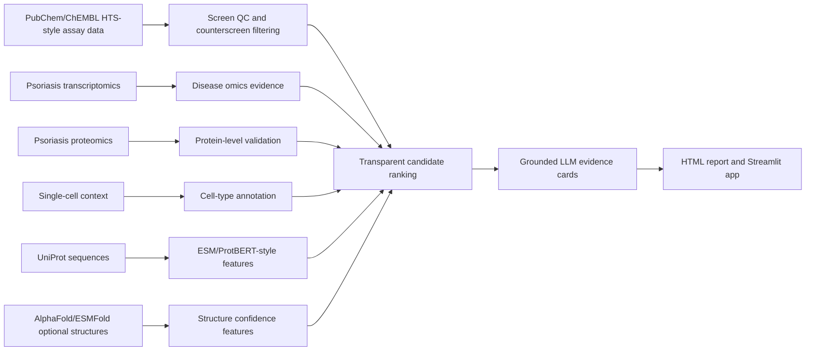

# HTS_IL17_Psoriasis

**A FAIR Nextflow workflow and Streamlit app for integrating public HTS/qHTS assay data, psoriasis omics, proteomics, protein AI model features, structural evidence, and grounded LLM summaries for target and hit prioritization.**

## Links

- **GitHub repo:** https://github.com/Caffeinated-Code/HTS_IL17_Psoriasis
- **Published dashboard:** https://caffeinated-code.github.io/HTS_IL17_Psoriasis/
- **Local Streamlit app:** `streamlit run app/streamlit_app.py`

This is an employer-neutral portfolio project. It uses public or toy data only and makes conservative claims: the workflow is a screening-to-biology prioritization demo, not a clinical efficacy model.

## What This Project Demonstrates

`HTS_IL17_Psoriasis` models a realistic early-discovery question:

> If a pathway-proximal screening assay nominates compounds or targets around ROR gamma / Th17 biology, which candidates also have psoriasis disease evidence, proteomics support, cell-type context, and interpretable protein-level features?

The project is intentionally transparent. It favors auditable scoring, provenance, and documented limitations over black-box ranking.

## Why Psoriasis And IL-17 Biology?

Plaque psoriasis is a strong public-data case study because the IL-23 / Th17 / IL-17 axis is well established, skin biopsy datasets are available, and disease activity can be connected to immune activation, keratinocyte response, and inflammatory proteomics.

The HTS component uses public ROR gamma qHTS-style assay data as a pathway-proximal screening analog. ROR gamma t is upstream of Th17 differentiation and IL-17 production. This is not a direct IL-17 peptide screen, and the workflow calls out that limitation.

## Quickstart

Requirements:

- Nextflow
- Python 3
- Streamlit, pandas, and plotly for the app

Run the local demo:

```bash
nextflow run main.nf -profile test
```

Launch the app after the workflow completes:

```bash
streamlit run app/streamlit_app.py
```

The app reads generated outputs from `results/app_data/`. If those files are missing, it falls back to bundled demo tables in `demo_data/`.

## Workflow Overview



## Outputs

- `results/tables/candidate_rankings.tsv`
- `results/tables/screen_qc.tsv`
- `results/tables/disease_omics.tsv`
- `results/tables/proteomics_validation.tsv`
- `results/tables/singlecell_context.tsv`
- `results/tables/protein_features.tsv`
- `results/tables/structure_features.tsv`
- `results/evidence_cards/evidence_cards.md`
- `results/reports/HTS_IL17_Psoriasis_report.html`
- `results/provenance/run_provenance.json`
- `results/app_data/` tables used by Streamlit

## Public Dataset Plan

The demo ships with small cached toy tables shaped like the public sources below. Full retrieval modules are documented as future work.

| Evidence layer | Public source | Why it is used |
| --- | --- | --- |
| HTS/qHTS | PubChem AID 2604 ROR gamma transcriptional activity screen; PubChem AID 2546 VP16 counterscreen | Screening-style pathway-proximal assay data for Th17/IL-17 biology |
| Bioactivity context | ChEMBL ROR gamma / IL-17 pathway assay records | Curated drug discovery assay context |
| Disease transcriptomics | GSE54456 psoriasis lesional vs normal skin RNA-seq | Disease expression support |
| Proteomics | PRIDE PXD021673 psoriasis skin LC-MS/MS | Protein-level validation |
| Single-cell | GSE162183 psoriasis skin scRNA-seq | Cell-type context |

## Director-Level Caveats

- ROR gamma qHTS is pathway-proximal, not a direct IL-17 peptide screen.
- Public screening data are small-molecule assays, used here as an HTS data analog.
- Protein language model features are descriptive unless validated in a predictive task.
- AlphaFold or ESMFold confidence supports structural plausibility, not binding proof.
- LLM summaries are grounded in workflow outputs and should never create unsupported biological claims.

For a critical staff-scientist-style review and sequential improvement roadmap, see [DIRECTOR_REVIEW.md](DIRECTOR_REVIEW.md).

## Documentation Primers

- [HTS primer](docs/hts_primer.md)
- [IL-17 psoriasis primer](docs/il17_psoriasis_primer.md)
- [Proteomics primer](docs/proteomics_primer.md)
- [Protein language models primer](docs/protein_language_models_primer.md)
- [Structure prediction primer](docs/structure_prediction_primer.md)
- [LLM evidence primer](docs/llm_evidence_primer.md)
- [FAIR Nextflow and AWS primer](docs/fair_nextflow_aws_primer.md)
