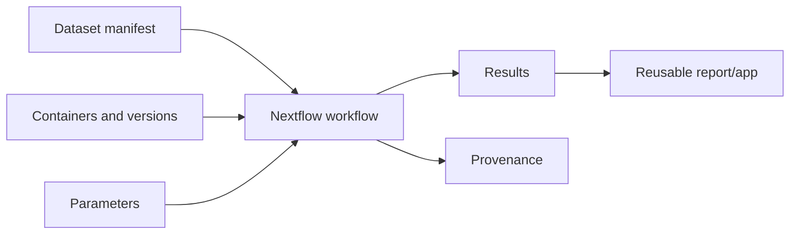

# FAIR Nextflow And AWS Primer

FAIR means data and workflows should be Findable, Accessible, Interoperable, and Reusable. A workflow does not become FAIR just because it runs; it needs metadata, provenance, versioning, and clear outputs.

## FAIR Choices In This Project

- stable dataset accessions in `data/dataset_manifest.yaml`
- parameterized paths
- standardized results folders
- provenance JSON
- documented caveats and public-data limitations
- test profile for quick validation

## AWS Adaptation

The `awsbatch` profile is a template for S3-backed execution with AWS Batch. Before using it, replace:

- `YOUR_AWS_BATCH_QUEUE`
- `YOUR_ECR_OR_PUBLIC_CONTAINER`
- `s3://YOUR_BUCKET/...`

## Common Pitfalls

- Hardcoded local paths.
- Missing dataset versions or accessions.
- Reports without provenance.
- Cloud workflows that cannot run locally in a small test mode.
