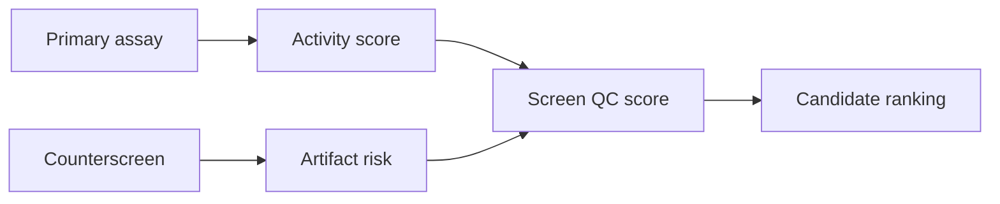

# HTS And qHTS Primer

High-throughput screening (HTS) tests many perturbations in a standardized assay. Quantitative HTS (qHTS) often tests multiple concentrations and can support dose-response interpretation.

## Why It Matters Here

This project uses public ROR gamma qHTS-style data as a pathway-proximal screening analog for Th17 / IL-17 biology.

## Common Pitfalls

- A hit can reflect assay interference rather than biology.
- Counterscreens reduce false positives but do not eliminate all artifacts.
- A pathway-proximal screen is not the same as a direct target-binding assay.
- Strong activity without disease relevance may not be useful for discovery.

## Project Guardrail

ROR gamma qHTS is treated as screening evidence for upstream Th17 biology, not as proof of direct IL-17 peptide modulation.
