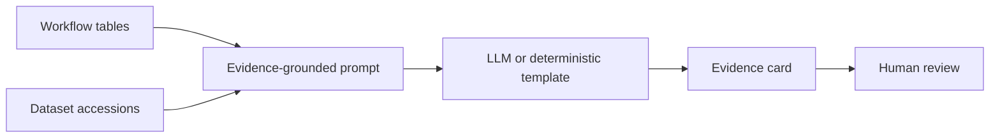

# Grounded LLM Evidence Primer

An LLM can be useful for summarizing structured scientific evidence, but it must be constrained. In this project, the LLM role is evidence synthesis, not discovery by memory.

## Inputs

- HTS activity and counterscreen status
- Disease expression evidence
- Proteomics support
- Cell-type context
- Protein AI and structure feature notes
- Dataset accessions and workflow provenance

## Outputs

- concise biological rationale
- limitations and uncertainty
- suggested next validation experiment
- citations to workflow outputs and public accessions

## Guardrails

- No uncited biological claims.
- No clinical efficacy claims.
- No company-specific claims.
- Separate supported evidence from hypotheses.

## Local Demo Mode

The current workflow uses deterministic templates to produce LLM-style evidence cards. This keeps the project runnable without an API key while documenting exactly how a real LLM/RAG module should behave.
