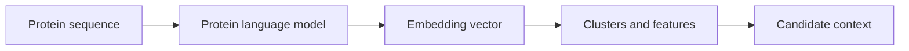

# Protein Language Models Primer

Protein language models such as ESM-2, ProtBERT, and ProtTrans learn representations of protein sequences from large collections of proteins. Their embeddings can capture sequence similarity, family structure, and some biochemical context.

## Why It Matters Here

Protein embeddings provide a reusable feature layer for candidate proteins or peptides. They can help cluster candidates, compare sequence families, or feed downstream ranking models.

## Common Pitfalls

- Embeddings are not explanations by themselves.
- A model trained on sequence does not automatically understand assay biology.
- Predictive use requires validation on a relevant task.

## Project Guardrail

This example uses protein model scores as contextual features only. They do not prove mechanism or efficacy.
