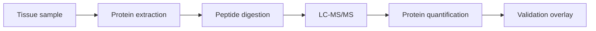

# Proteomics Primer

Proteomics measures proteins more directly than RNA-seq. In LC-MS/MS experiments, proteins are digested into peptides, measured by mass spectrometry, and inferred back to protein-level abundance.

## Why It Matters Here

RNA evidence alone can over-prioritize genes whose protein products are not changed or detectable. Proteomics adds an orthogonal evidence layer.

## Common Pitfalls

- RNA and protein abundance are not always concordant.
- Low-abundance cytokines can be difficult to detect.
- Protein inference can be complicated by shared peptides and isoforms.

## Project Guardrail

Weak proteomics support is flagged rather than hidden, especially when RNA evidence is strong.
