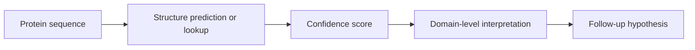

# Structure Prediction Primer

AlphaFold and ESMFold-style methods predict protein structures from sequence. They are valuable for structural context, domain interpretation, and hypothesis generation.

## Why It Matters Here

Structure confidence can help decide whether a candidate has interpretable domains or regions suitable for follow-up modeling.

## Common Pitfalls

- High-confidence structure does not prove ligand binding.
- Flexible, disordered, or interface regions may be lower confidence.
- Protein-protein or peptide-target interactions require additional modeling and validation.

## Project Guardrail

Structure features support prioritization but never claim direct binding without experimental evidence.
